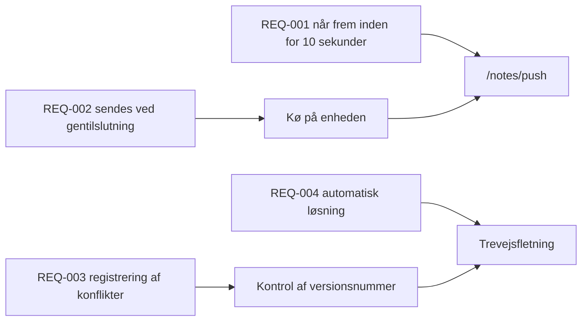

---
navigation:
  order: 30
---

# 2.3 Sporbarhed

Krav knyttes til de enkelte elementer i [arkitekturen](../03-architecture/README.md) og til de enkelte endepunkter i [API'et](../04-api/README.md). Et krav uden en sådan tilknytning regnes som ikke implementeret.

