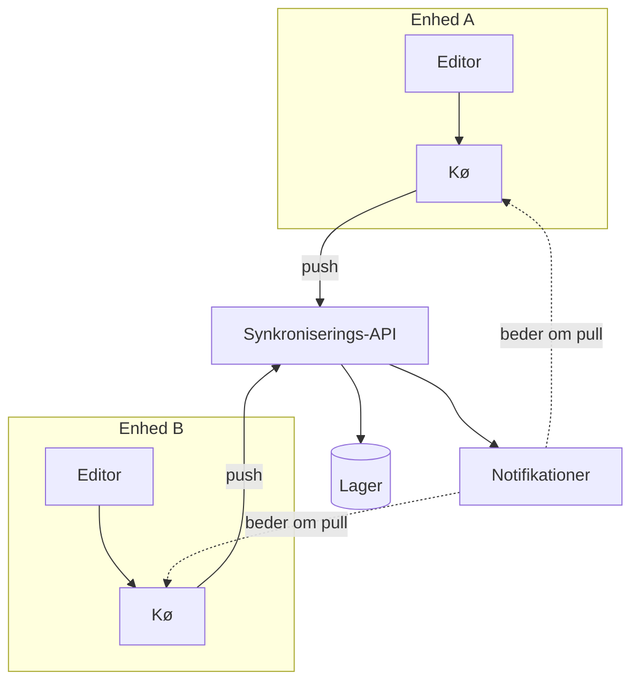

---
navigation:
  order: 10
---

# 3.1 Komponenter

| Element | Rolle |
|---|---|
| Klient | Overvåger redigeringer af noter, sætter ændringerne i kø og sender dem til serveren, når der er forbindelse |
| Synkroniserings-API | Modtager ændringer, tildeler versionsnumre og fordeler dem til andre enheder |
| Lager | Indeholder hver notes aktuelle indhold og de seneste 30 dages historik |
| Notifikationer | Sender et let signal til en enhed for at få den til at hente, når der er sket en ændring |

