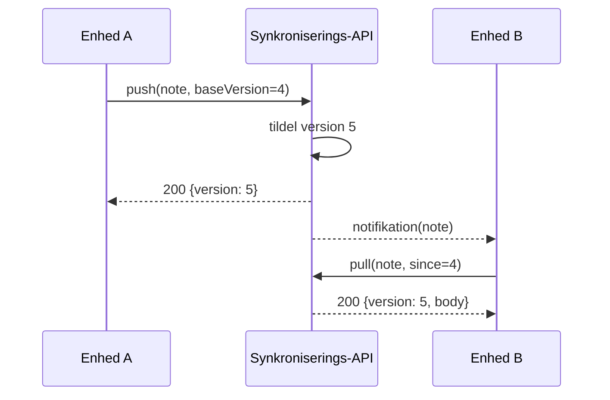

---
navigation:
  order: 20
---

# 3.2 Synkroniseringsforløbet

Ændringen fra enhed A får en ny version på serveren, og enhed B henter den, når den har fået besked. Notifikationen er blot et signal om at hente; den indeholder ikke selve indholdet.
