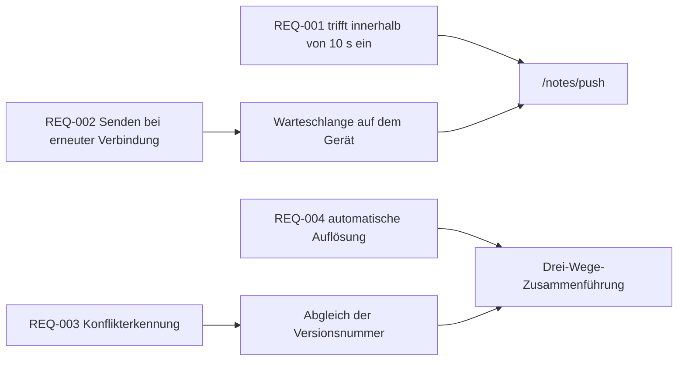

---
navigation:
  order: 30
---

# 2.3 Nachverfolgbarkeit der Anforderungen

Die Anforderungen werden den Elementen der [Architektur](../03-architecture/README.md) und den Endpunkten der [API](../04-api/README.md) zugeordnet. Eine Anforderung ohne Zuordnung gilt als nicht umgesetzt.

