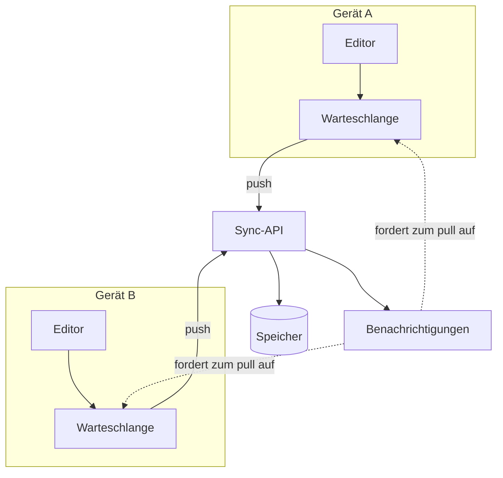

---
navigation:
  order: 10
---

# 3.1 Komponenten

| Element | Aufgabe |
|---|---|
| Client | Überwacht Änderungen an Notizen, stellt sie in eine Warteschlange und sendet sie bei bestehender Verbindung an den Server |
| Sync-API | Nimmt Änderungen entgegen, vergibt Versionsnummern und verteilt sie an die anderen Geräte |
| Speicher | Enthält den aktuellen Inhalt jeder Notiz sowie deren Verlauf der letzten 30 Tage |
| Benachrichtigungen | Sendet bei einer Änderung ein leichtgewichtiges Signal an das Gerät, das zum Abruf auffordert |

