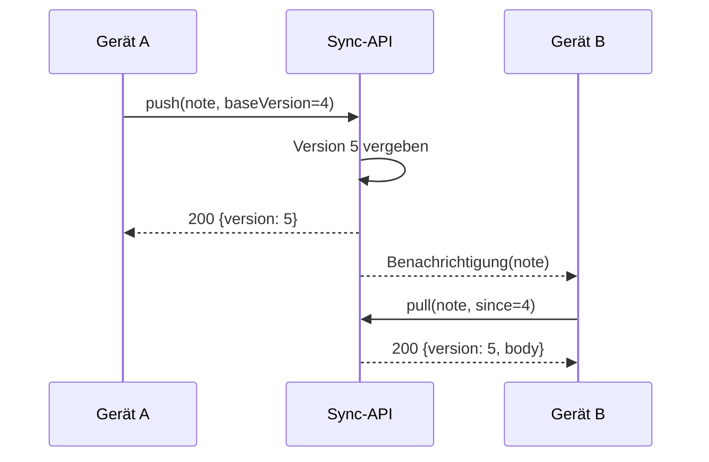

---
navigation:
  order: 20
---

# 3.2 Der Ablauf der Synchronisierung

Die Änderung von Gerät A erhält auf dem Server eine neue Version, und Gerät B ruft sie nach der Benachrichtigung ab. Die Benachrichtigung ist ein Signal zum Abrufen; sie transportiert keinen Inhalt.
