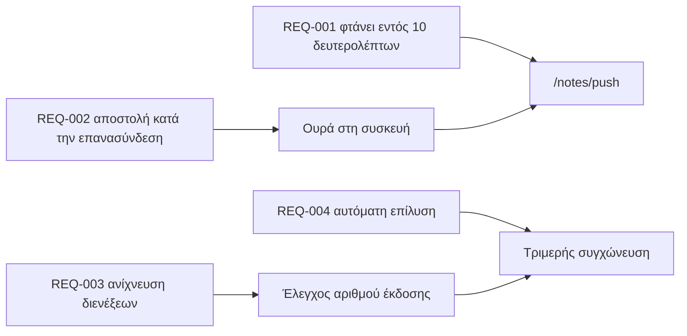

---
navigation:
  order: 30
---

# 2.3 Ιχνηλασιμότητα απαιτήσεων

Οι απαιτήσεις αντιστοιχίζονται στα στοιχεία της [αρχιτεκτονικής](../03-architecture/README.md) και στα τελικά σημεία του [API](../04-api/README.md). Μια απαίτηση χωρίς αντιστοίχιση θεωρείται μη υλοποιημένη.

