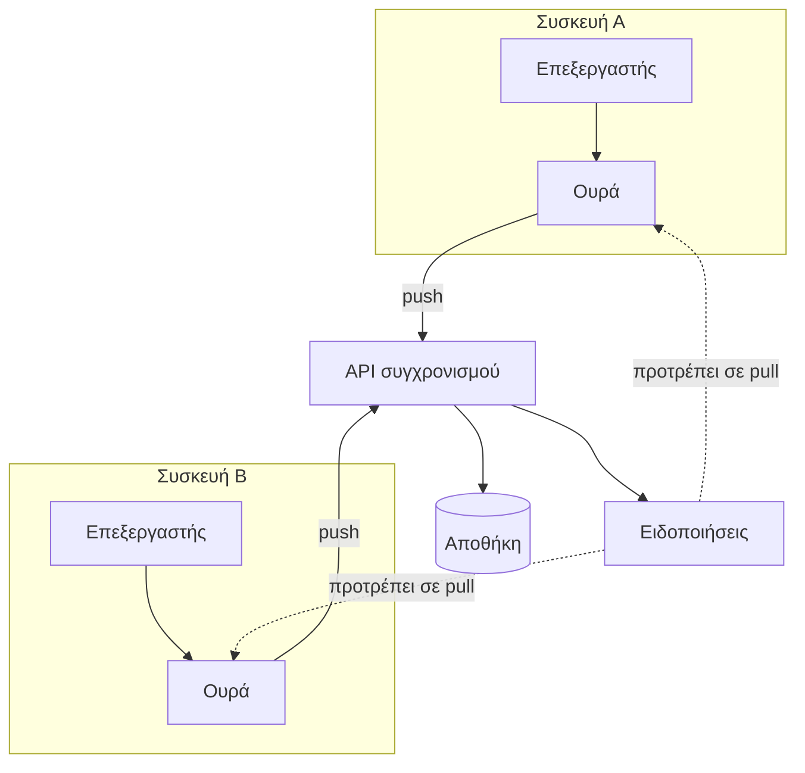

---
navigation:
  order: 10
---

# 3.1 Συστατικά στοιχεία

| Στοιχείο | Ρόλος |
|---|---|
| Πελάτης | Παρακολουθεί τις επεξεργασίες των σημειώσεων, βάζει τις αλλαγές σε ουρά και τις στέλνει στον διακομιστή κατά τη σύνδεση |
| API συγχρονισμού | Δέχεται τις αλλαγές, αποδίδει αριθμούς έκδοσης και τις διανέμει στις άλλες συσκευές |
| Αποθήκη | Το τρέχον περιεχόμενο κάθε σημείωσης και το ιστορικό των τελευταίων 30 ημερών |
| Ειδοποιήσεις | Στέλνουν ένα ελαφρύ σήμα στη συσκευή όπου υπήρξε αλλαγή, ώστε να ζητήσει τα δεδομένα |

