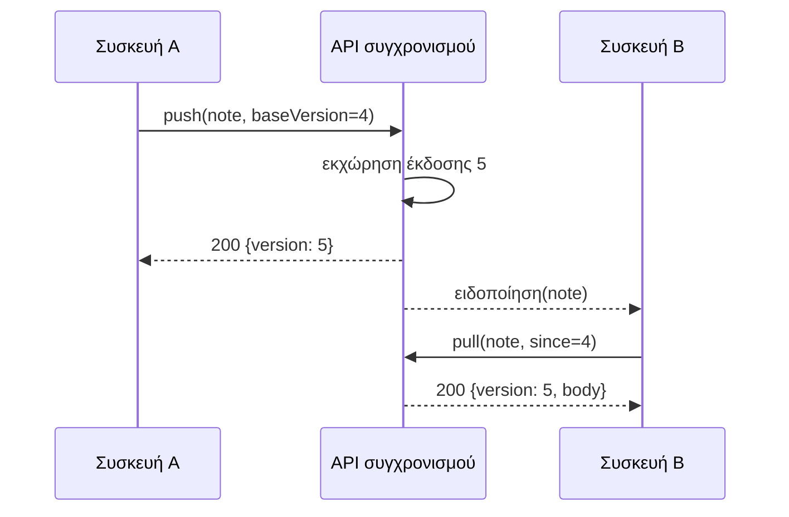

---
navigation:
  order: 20
---

# 3.2 Η ροή συγχρονισμού

Η αλλαγή της συσκευής A λαμβάνει νέα έκδοση στον διακομιστή και η συσκευή B, αφού ειδοποιηθεί, την ανακτά. Η ειδοποίηση είναι σήμα που προτρέπει την ανάκτηση· δεν μεταφέρει το σώμα του κειμένου.
