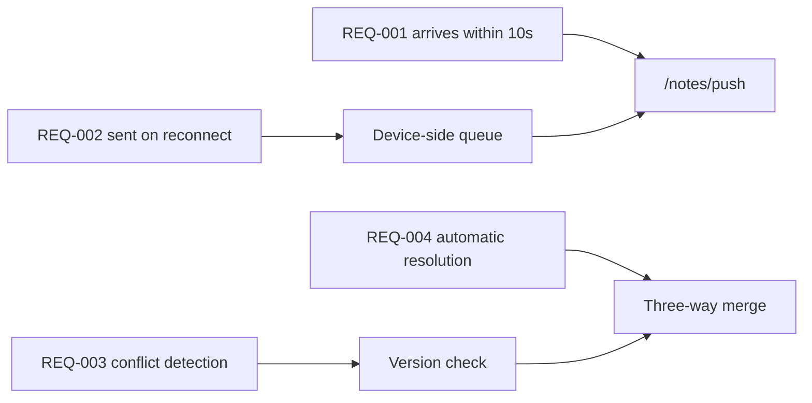

---
navigation:
  order: 30
---

# 2.3 Traceability

Requirements are mapped to the elements of [the architecture](../03-architecture/README.md) and the endpoints of [the API](../04-api/README.md). A requirement with no mapping is treated as unimplemented.

