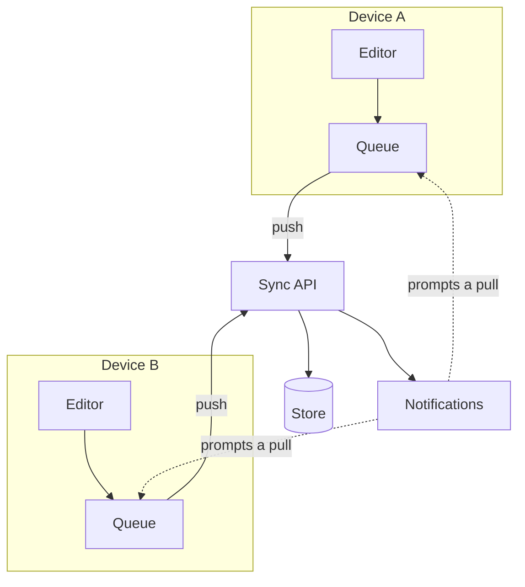

---
navigation:
  order: 10
---

# 3.1 Components

| Element | Role |
|---|---|
| Client | Watches for edits to notes, queues the changes, and sends them to the server on connection |
| Sync API | Accepts changes, assigns version numbers, and distributes them to other devices |
| Store | Holds each note's current content and its last 30 days of history |
| Notifications | Sends a lightweight signal to prompt a device to pull, when a change has occurred |

