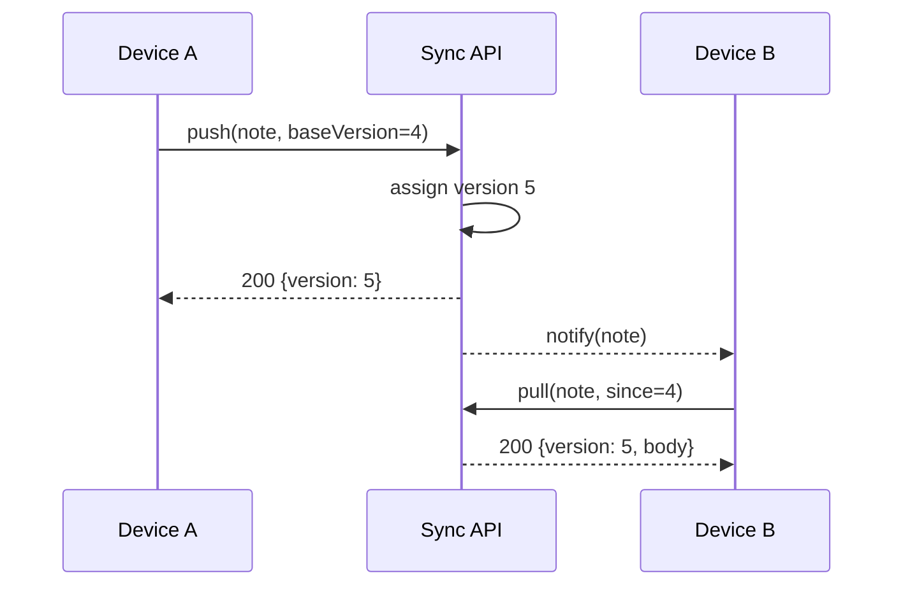

---
navigation:
  order: 20
---

# 3.2 The sync flow

Device A's change gets a new version on the server, and device B pulls it once notified. The notification is a prompt to pull; it carries no body.
