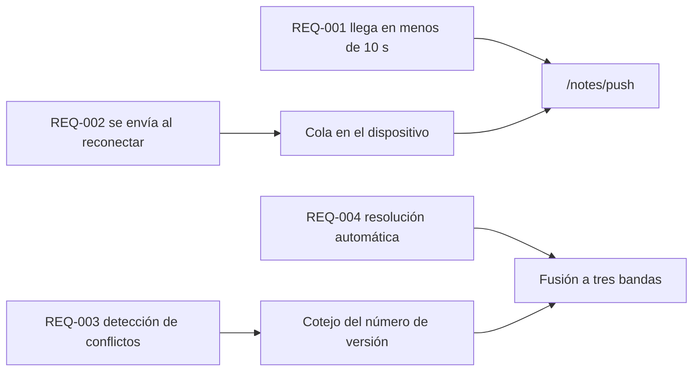

---
navigation:
  order: 30
---

# 2.3 Trazabilidad de los requisitos

Los requisitos se corresponden con cada elemento de [la arquitectura](../03-architecture/README.md) y con cada endpoint de [la API](../04-api/README.md). Un requisito sin correspondencia se considera no implementado.

