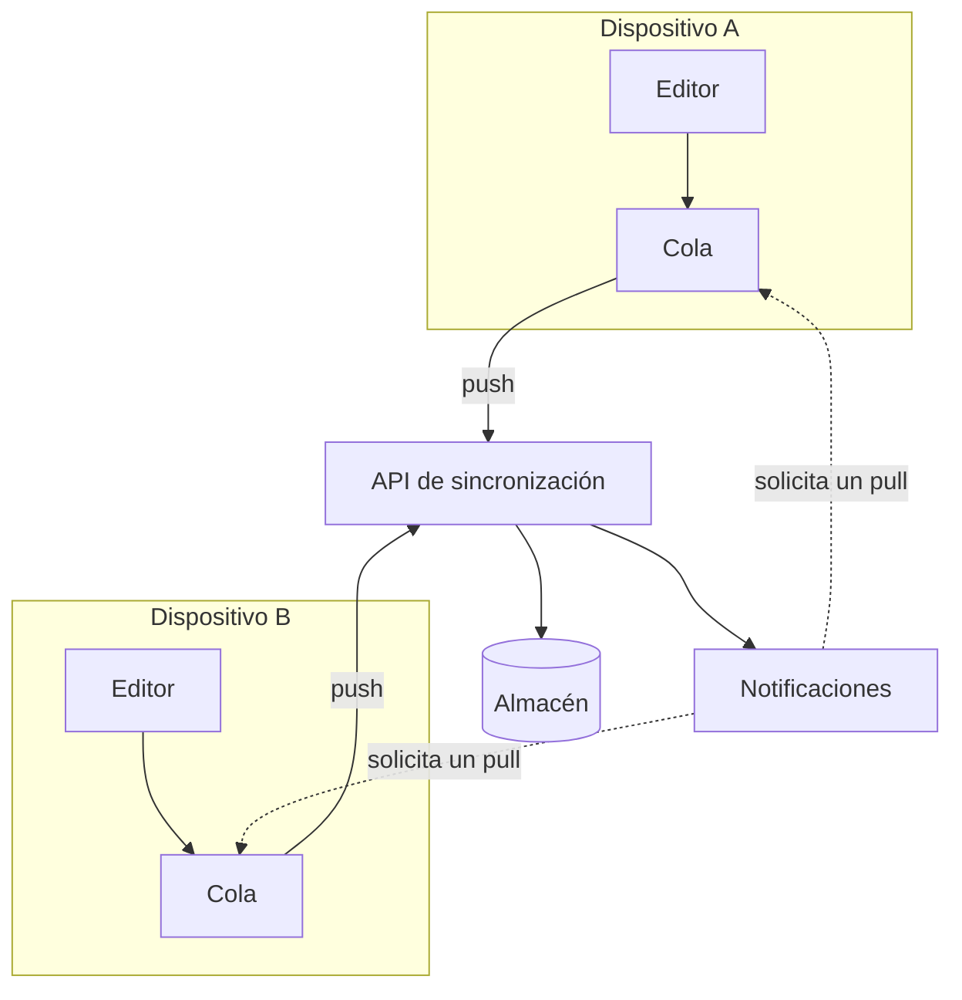

---
navigation:
  order: 10
---

# 3.1 Componentes

| Elemento | Función |
|---|---|
| Cliente | Observa las ediciones de las notas, pone los cambios en cola y los envía al servidor al conectarse |
| API de sincronización | Acepta los cambios, asigna los números de versión y los distribuye a los demás dispositivos |
| Almacén | Guarda el contenido actual de cada nota y su historial de los últimos 30 días |
| Notificaciones | Envía una señal ligera para que un dispositivo recupere los cambios, cuando se ha producido alguno |

