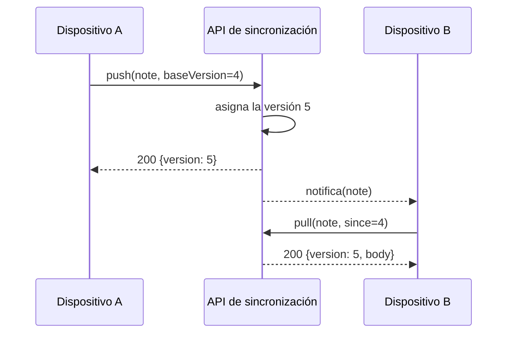

---
navigation:
  order: 20
---

# 3.2 El flujo de sincronización

El cambio del dispositivo A obtiene una versión nueva en el servidor, y el dispositivo B, tras recibir la notificación, lo descarga. La notificación es una señal que invita a descargar; no transporta el cuerpo del texto.
