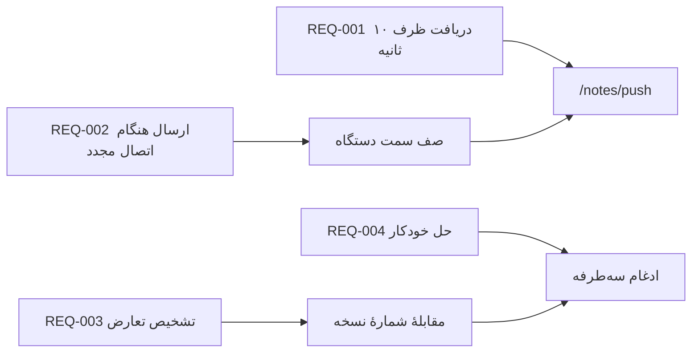

---
navigation:
  order: 30
---

# ۲.۳ ردیابی الزامات

هر الزام به عناصر [معماری](../03-architecture/README.md) و نقاط پایانی [API](../04-api/README.md) نگاشت می‌شود. الزامی که نگاشتی ندارد، پیاده‌سازی‌نشده در نظر گرفته می‌شود.

