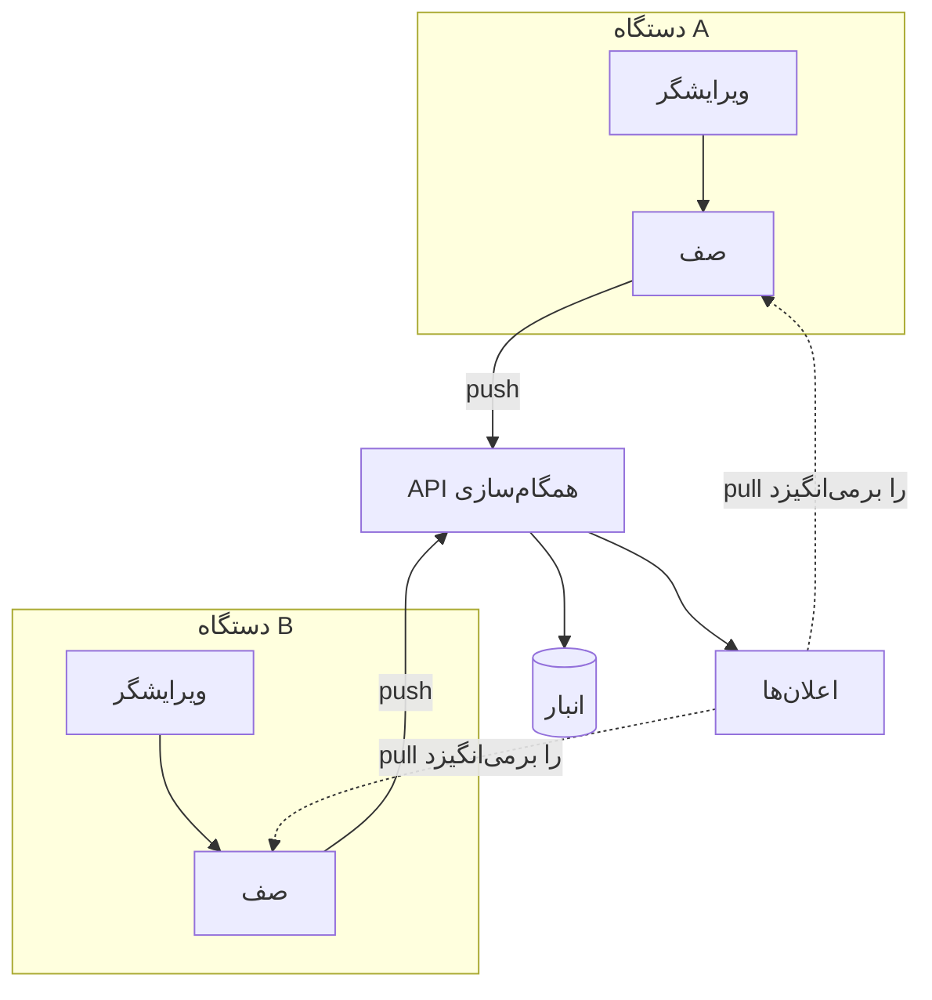

---
navigation:
  order: 10
---

# ۳.۱ اجزای تشکیل‌دهنده

| عنصر | نقش |
|---|---|
| کلاینت | ویرایش یادداشت‌ها را زیر نظر می‌گیرد، تغییرها را در صف قرار می‌دهد و هنگام اتصال به سرور می‌فرستد |
| API همگام‌سازی | پذیرش تغییرها، شماره‌گذاری نسخه‌ها و توزیع آن‌ها به دستگاه‌های دیگر |
| انبار | محتوای کنونی هر یادداشت و تاریخچهٔ ۳۰ روز اخیر آن |
| اعلان‌ها | هنگام رخ دادن یک تغییر، نشانه‌ای سبک به دستگاه می‌فرستد تا دریافت را آغاز کند |

