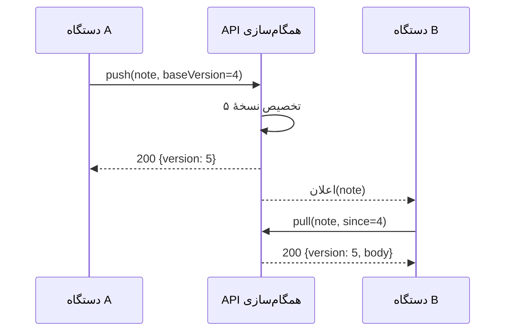

---
navigation:
  order: 20
---

# ۳.۲ جریان همگام‌سازی

تغییر دستگاه A روی سرور نسخهٔ تازه‌ای می‌گیرد و دستگاه B پس از دریافت اعلان آن را می‌گیرد. اعلان تنها نشانه‌ای برای دریافت است و متن را با خود نمی‌آورد.
