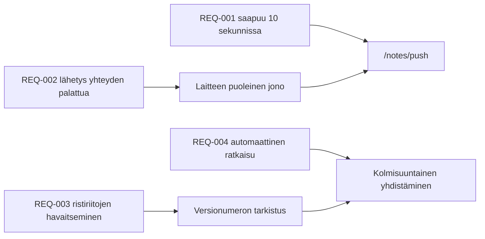

---
navigation:
  order: 30
---

# 2.3 Vaatimusten jäljitettävyys

Vaatimukset kytketään [arkkitehtuurin](../03-architecture/README.md) osiin ja [API:n](../04-api/README.md) päätepisteisiin. Vaatimusta, jolla ei ole vastinetta, käsitellään toteuttamattomana.

