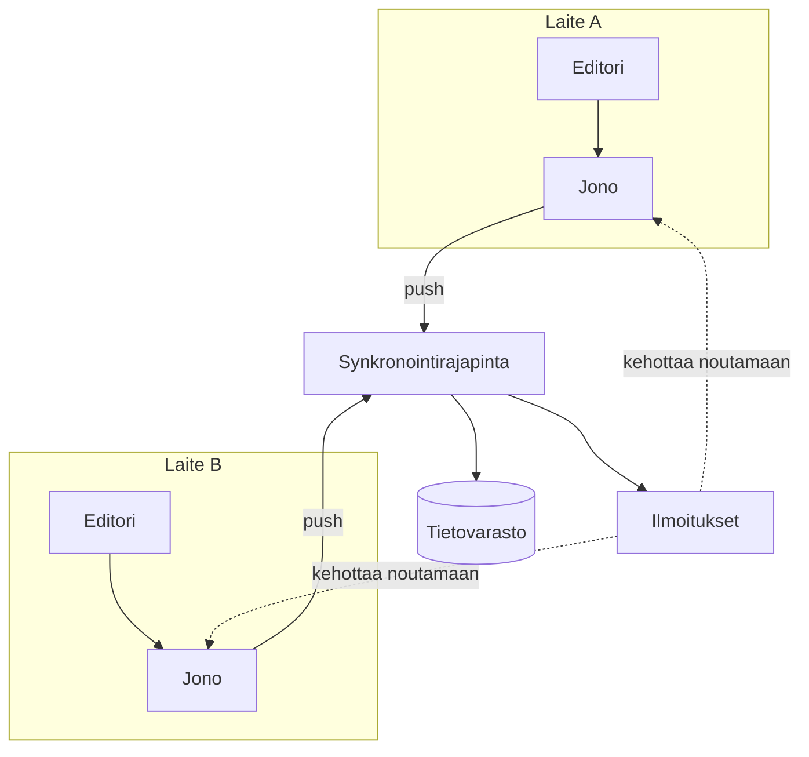

---
navigation:
  order: 10
---

# 3.1 Osat

| Osa | Tehtävä |
|---|---|
| Asiakasohjelma | Tarkkailee muistiinpanojen muokkauksia, asettaa muutokset jonoon ja lähettää ne palvelimelle yhteyden muodostuessa |
| Synkronointirajapinta | Ottaa muutokset vastaan, numeroi versiot ja jakaa ne muihin laitteisiin |
| Tietovarasto | Säilyttää kunkin muistiinpanon nykyisen sisällön ja viimeisten 30 päivän historian |
| Ilmoitukset | Lähettää muutoksen tapahtuessa kevyen viestin, joka kehottaa laitetta noutamaan muutokset |

