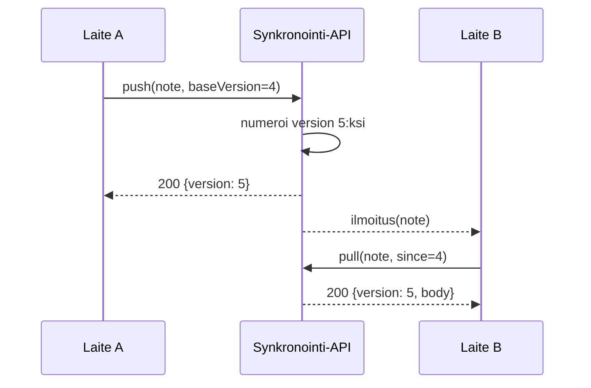

---
navigation:
  order: 20
---

# 3.2 Synkronoinnin kulku

Laitteen A muutos saa palvelimella uuden version, ja ilmoituksen saanut laite B noutaa sen. Ilmoitus on kehotus noutaa; se ei kuljeta sisältöä.
