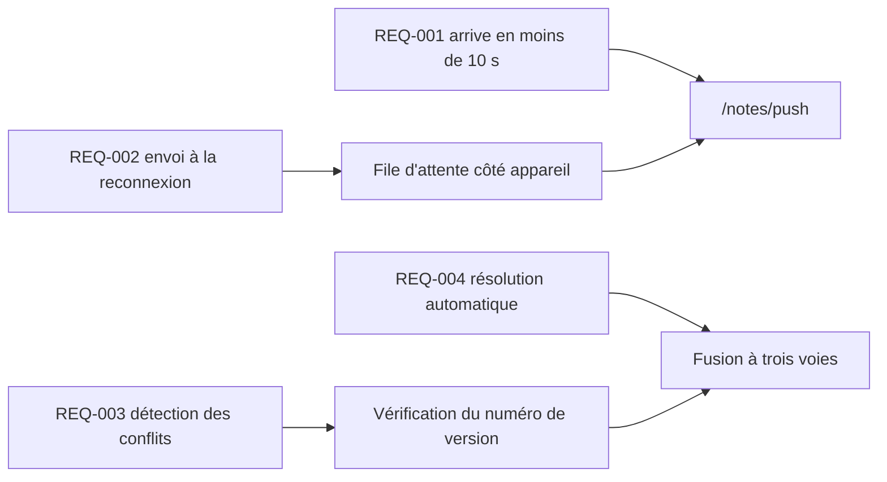

---
navigation:
  order: 30
---

# 2.3 Traçabilité des exigences

Les exigences sont mises en correspondance avec les éléments de [l'architecture](../03-architecture/README.md) et les points de terminaison de [l'API](../04-api/README.md). Une exigence sans correspondance est considérée comme non implémentée.

