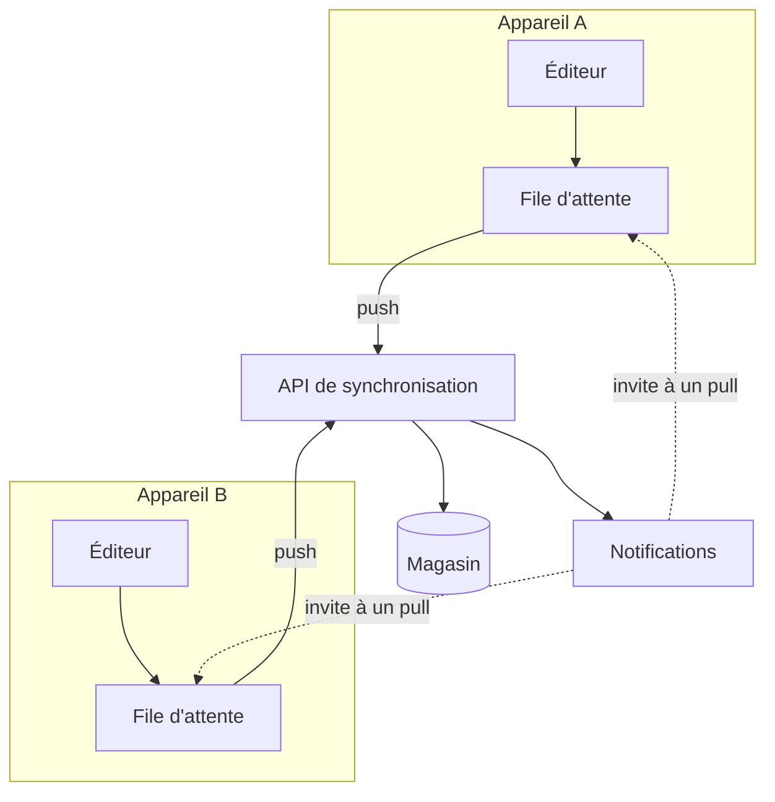

---
navigation:
  order: 10
---

# 3.1 Composants

| Élément | Rôle |
|---|---|
| Client | Surveille les modifications des notes, met les changements en file d'attente et les envoie au serveur lors de la connexion |
| API de synchronisation | Accepte les changements, attribue les numéros de version et les distribue aux autres appareils |
| Magasin | Contenu actuel de chaque note et historique des 30 derniers jours |
| Notifications | Envoie un signal léger à l'appareil concerné pour l'inviter à récupérer les changements |

