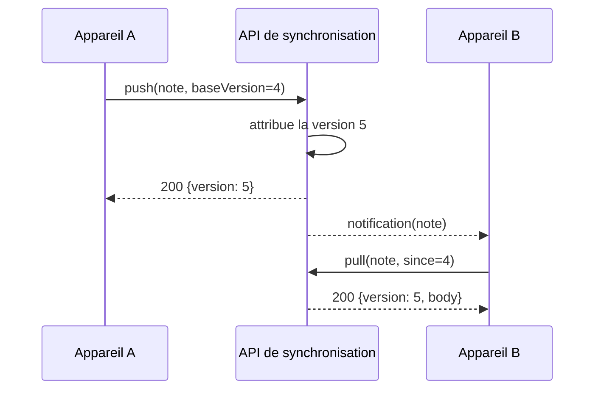

---
navigation:
  order: 20
---

# 3.2 Le flux de synchronisation

La modification de l'appareil A obtient une nouvelle version sur le serveur, et l'appareil B la récupère une fois notifié. La notification est un signal qui invite à récupérer ; elle ne transporte pas le corps du document.
