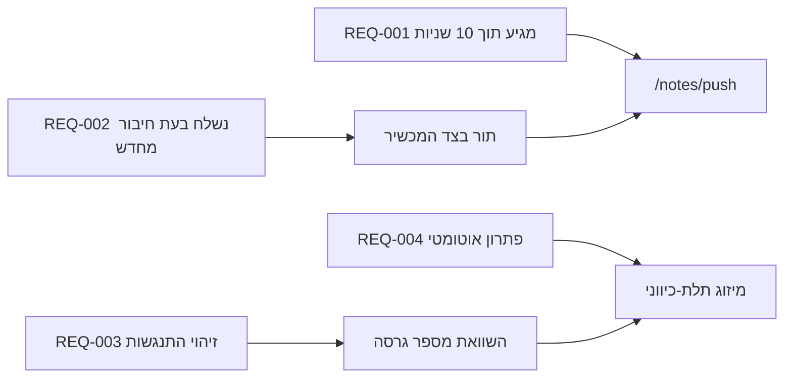

---
navigation:
  order: 30
---

# 2.3 מעקב אחר דרישות

הדרישות ממופות לרכיבי [המבנה](../03-architecture/README.md) ולנקודות הקצה של [ה‑API](../04-api/README.md). דרישה ללא מיפוי נחשבת לבלתי ממומשת.

