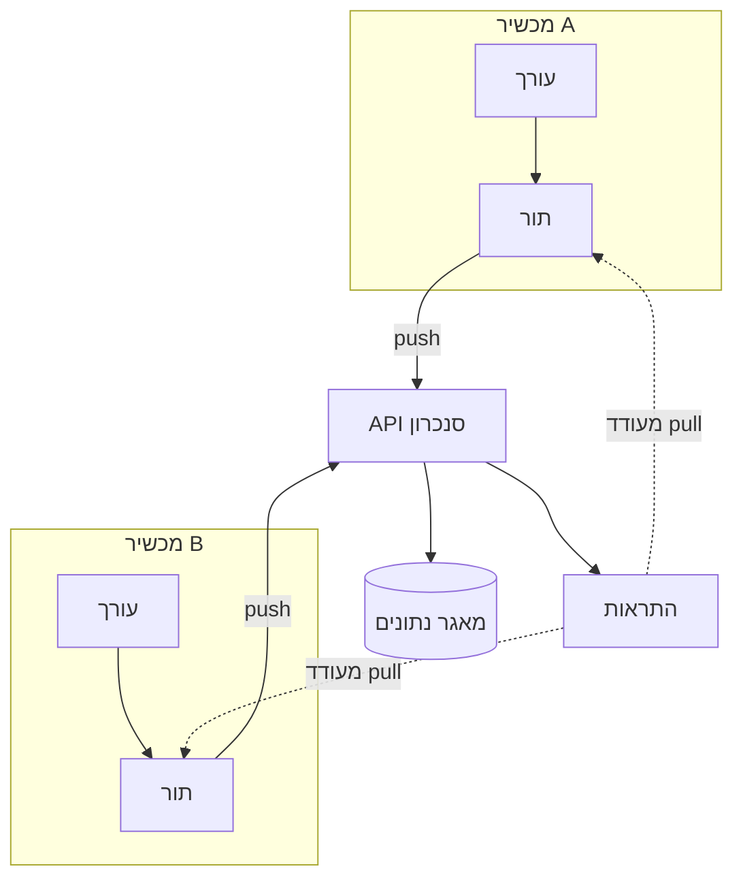

---
navigation:
  order: 10
---

# 3.1 רכיבים

| רכיב | תפקיד |
|---|---|
| לקוח | עוקב אחר עריכות בפתקים, מכניס את השינויים לתור ושולח אותם לשרת בעת ההתחברות |
| API סנכרון | מקבל שינויים, מקצה מספרי גרסה ומפיץ אותם לשאר המכשירים |
| מאגר נתונים | מחזיק את התוכן הנוכחי של כל פתק ואת ההיסטוריה של 30 הימים האחרונים |
| התראות | שולח אות קל למכשיר שבו חל שינוי, כדי לעודד משיכת עדכון |

