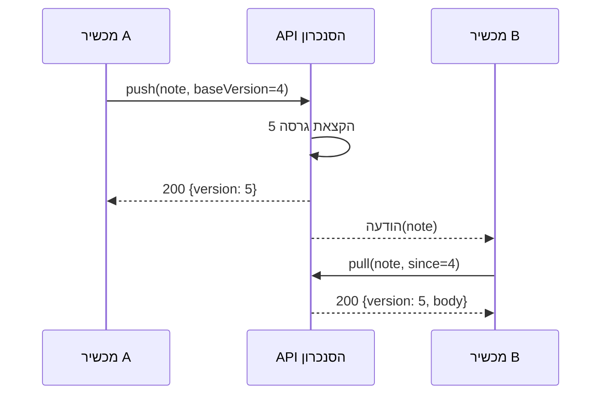

---
navigation:
  order: 20
---

# 3.2 תהליך הסנכרון

```mermaid
sequenceDiagram
  participant A as מכשיר A
  participant S as ‏API הסנכרון
  participant B as מכשיר B
  A->>S: push(note, baseVersion=4)
  S->>S: הקצאת גרסה 5
  S-->>A: 200 {version: 5}
  S-->>B: הודעה(note)
  B->>S: pull(note, since=4)
  S-->>B: 200 {version: 5, body}
```

השינוי של מכשיר A מקבל גרסה חדשה בשרת, ומכשיר B מושך אותה לאחר שקיבל הודעה. ההודעה היא אות לבצע משיכה; היא אינה נושאת את גוף המסמך.
