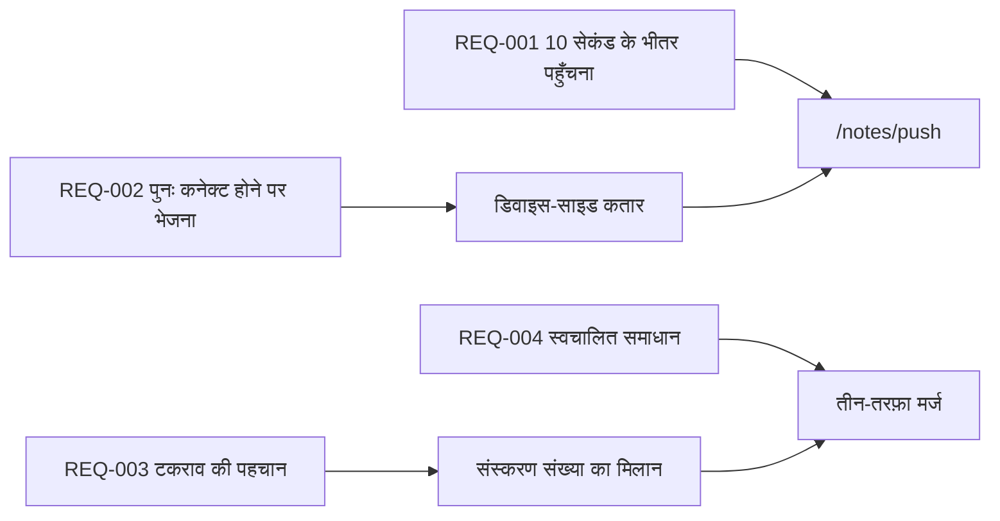

---
navigation:
  order: 30
---

# 2.3 आवश्यकताओं की ट्रेसेबिलिटी

आवश्यकताओं को [संरचना](../03-architecture/README.md) के प्रत्येक तत्व और [API](../04-api/README.md) के प्रत्येक एंडपॉइंट से संबद्ध किया जाता है। जिस आवश्यकता का कोई संबंध न हो, उसे अकार्यान्वित माना जाता है।

