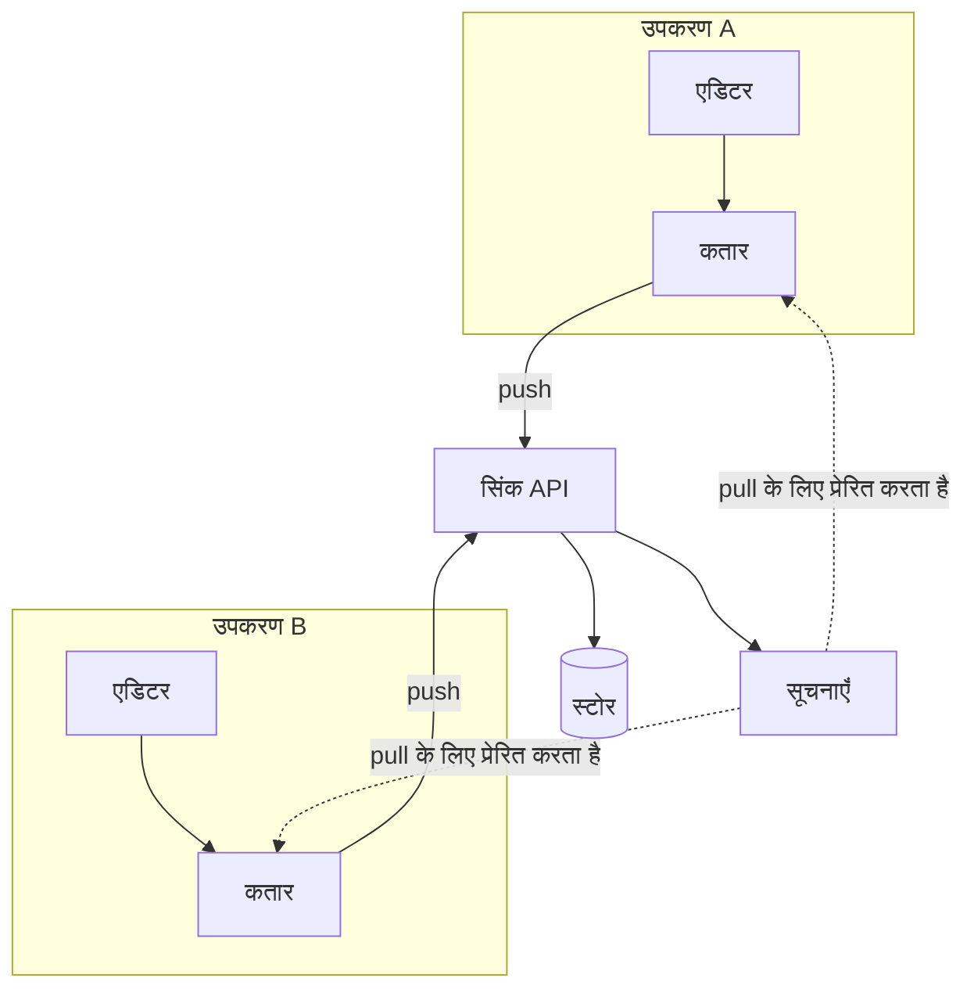

---
navigation:
  order: 10
---

# 3.1 घटक

| तत्व | भूमिका |
|---|---|
| क्लाइंट | नोट्स के संपादन पर नज़र रखता है, परिवर्तनों को कतार में डालता है, और कनेक्ट होने पर सर्वर को भेजता है |
| सिंक API | परिवर्तनों को स्वीकार करता है, संस्करण संख्या देता है, और अन्य उपकरणों को वितरित करता है |
| स्टोर | प्रत्येक नोट की वर्तमान सामग्री और पिछले 30 दिनों का इतिहास |
| सूचनाएँ | परिवर्तन होने पर, उपकरण को पुल के लिए प्रेरित करने वाला हल्का संकेत भेजता है |

