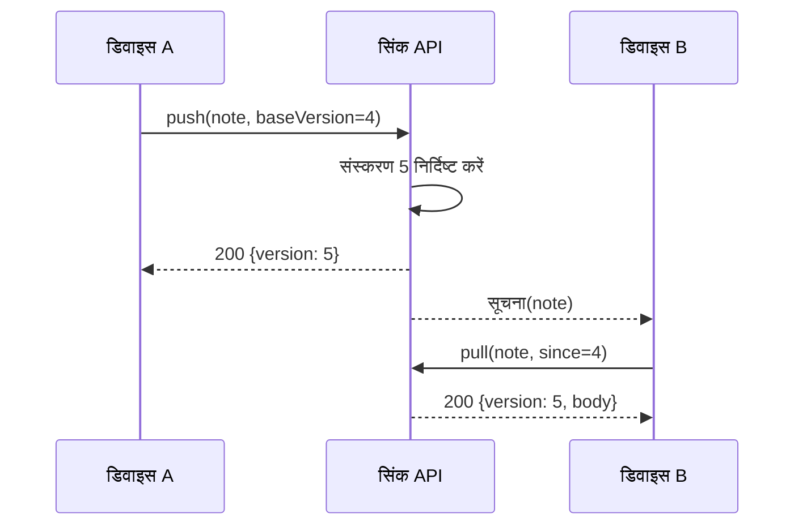

---
navigation:
  order: 20
---

# 3.2 सिंक का प्रवाह

डिवाइस A का परिवर्तन सर्वर पर नया संस्करण पाता है, और सूचना मिलने पर डिवाइस B उसे प्राप्त करता है। सूचना प्राप्ति का संकेत भर है; वह मुख्य सामग्री नहीं ले जाती।
