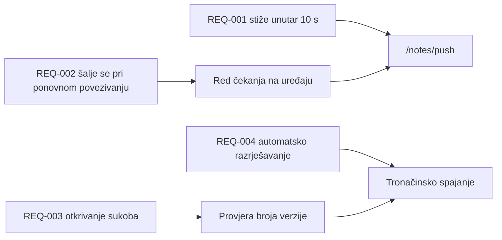

---
navigation:
  order: 30
---

# 2.3 Praćenje zahtjeva

Zahtjevi se pridružuju elementima [arhitekture](../03-architecture/README.md) i krajnjim točkama [API-ja](../04-api/README.md). Zahtjev bez pridruženog elementa smatra se neimplementiranim.

