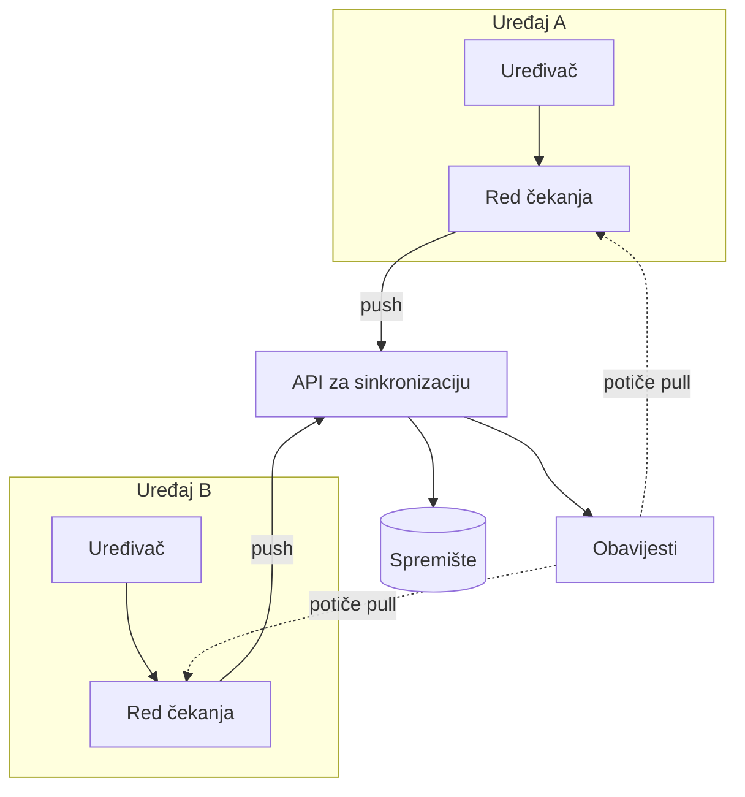

---
navigation:
  order: 10
---

# 3.1 Sastavni dijelovi

| Element | Uloga |
|---|---|
| Klijent | Prati uređivanje bilježaka, stavlja promjene u red čekanja i šalje ih poslužitelju pri povezivanju |
| API za sinkronizaciju | Prima promjene, dodjeljuje brojeve verzija i raspodjeljuje ih ostalim uređajima |
| Spremište | Trenutačni sadržaj svake bilješke i povijest zadnjih 30 dana |
| Obavijesti | Uređaju na kojem je došlo do promjene šalje lagani signal koji potiče dohvaćanje |

