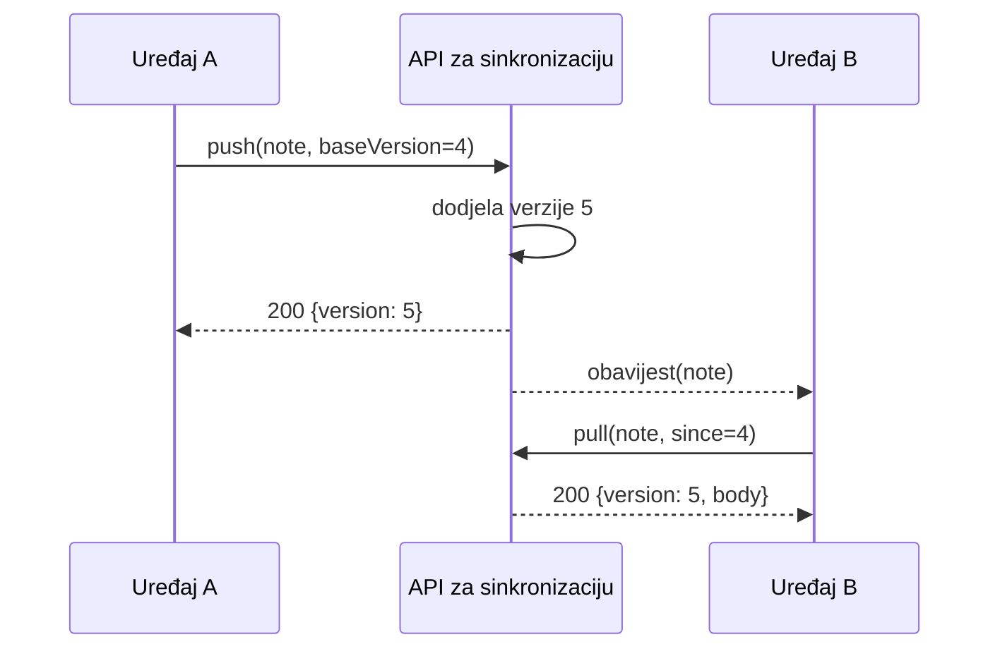

---
navigation:
  order: 20
---

# 3.2 Tijek sinkronizacije

Promjena s uređaja A dobiva novu verziju na poslužitelju, a uređaj B je preuzima nakon što primi obavijest. Obavijest je poticaj na preuzimanje; ona ne prenosi sadržaj.
