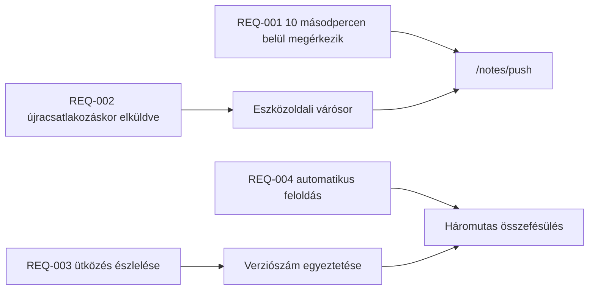

---
navigation:
  order: 30
---

# 2.3 A követelmények nyomon követése

A követelményeket hozzá kell rendelni [a felépítés](../03-architecture/README.md) egyes elemeihez és [az API](../04-api/README.md) egyes végpontjaihoz. A hozzárendelés nélküli követelmény megvalósítatlannak számít.

