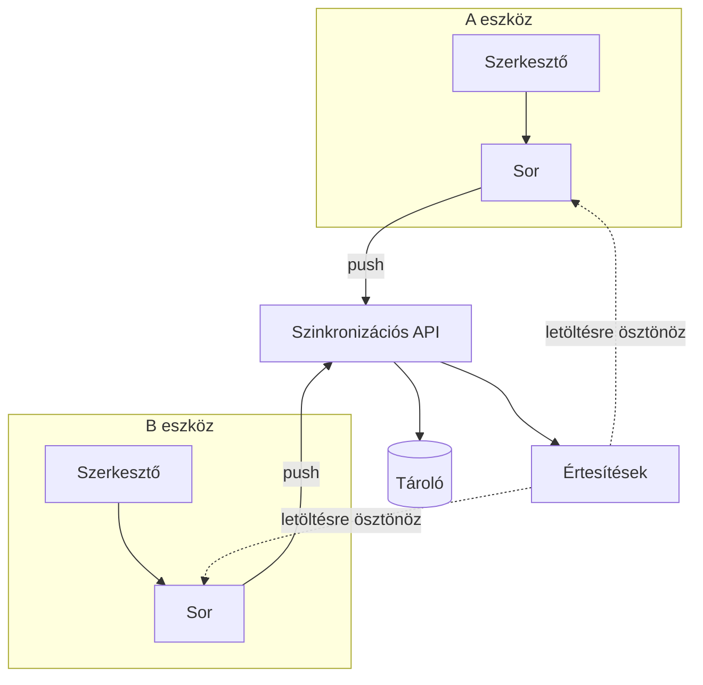

---
navigation:
  order: 10
---

# 3.1 Összetevők

| Elem | Szerep |
|---|---|
| Kliens | Figyeli a jegyzetek szerkesztését, sorba állítja a változásokat, és kapcsolódáskor elküldi őket a kiszolgálónak |
| Szinkronizációs API | Fogadja a változásokat, verziószámot ad nekik, és továbbítja őket a többi eszközre |
| Tároló | A jegyzetek aktuális tartalmát és az elmúlt 30 nap előzményeit őrzi |
| Értesítések | Változás esetén könnyű jelzést küld az eszköznek, hogy töltse le a változásokat |

