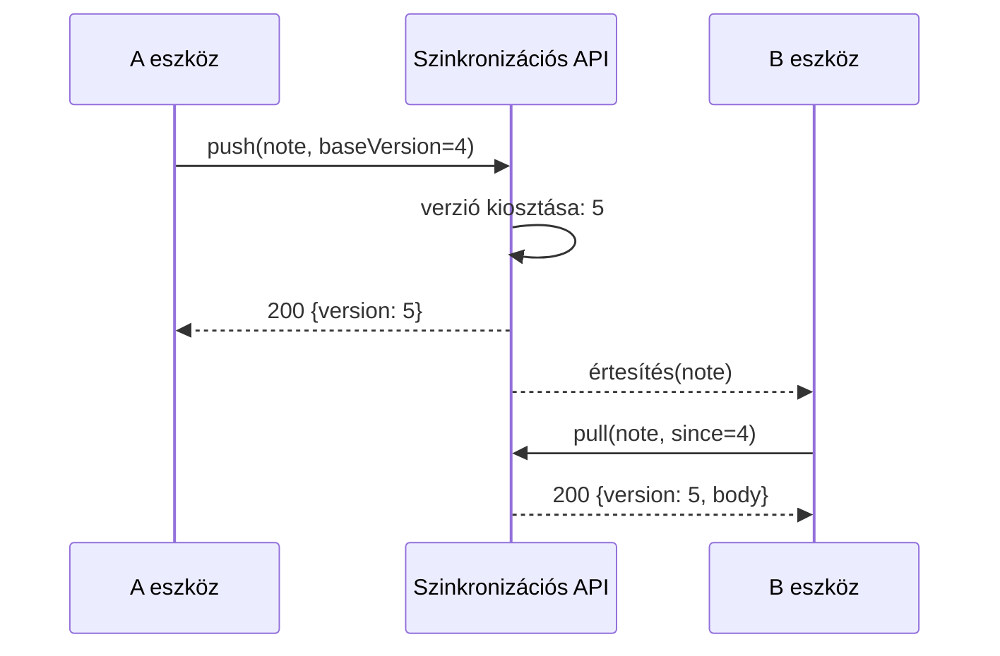

---
navigation:
  order: 20
---

# 3.2 A szinkronizálás folyamata

Az A eszköz módosítása a szerveren új verziót kap, és az értesítést megkapó B eszköz letölti azt. Az értesítés csak jelzés a letöltésre, a törzsszöveget nem szállítja.
