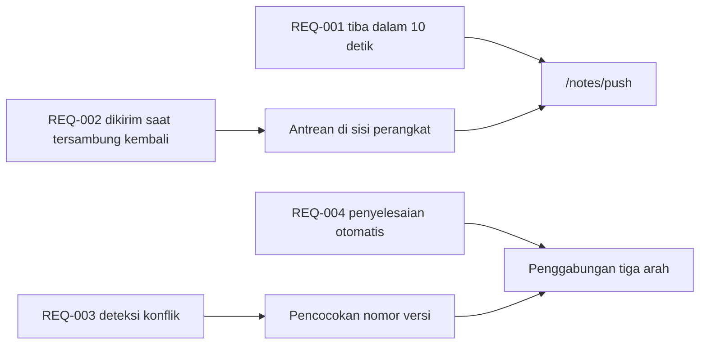

---
navigation:
  order: 30
---

# 2.3 Pelacakan persyaratan

Persyaratan dipetakan ke setiap elemen [arsitektur](../03-architecture/README.md) dan setiap endpoint [API](../04-api/README.md). Persyaratan yang tidak memiliki pemetaan dianggap belum diimplementasikan.

