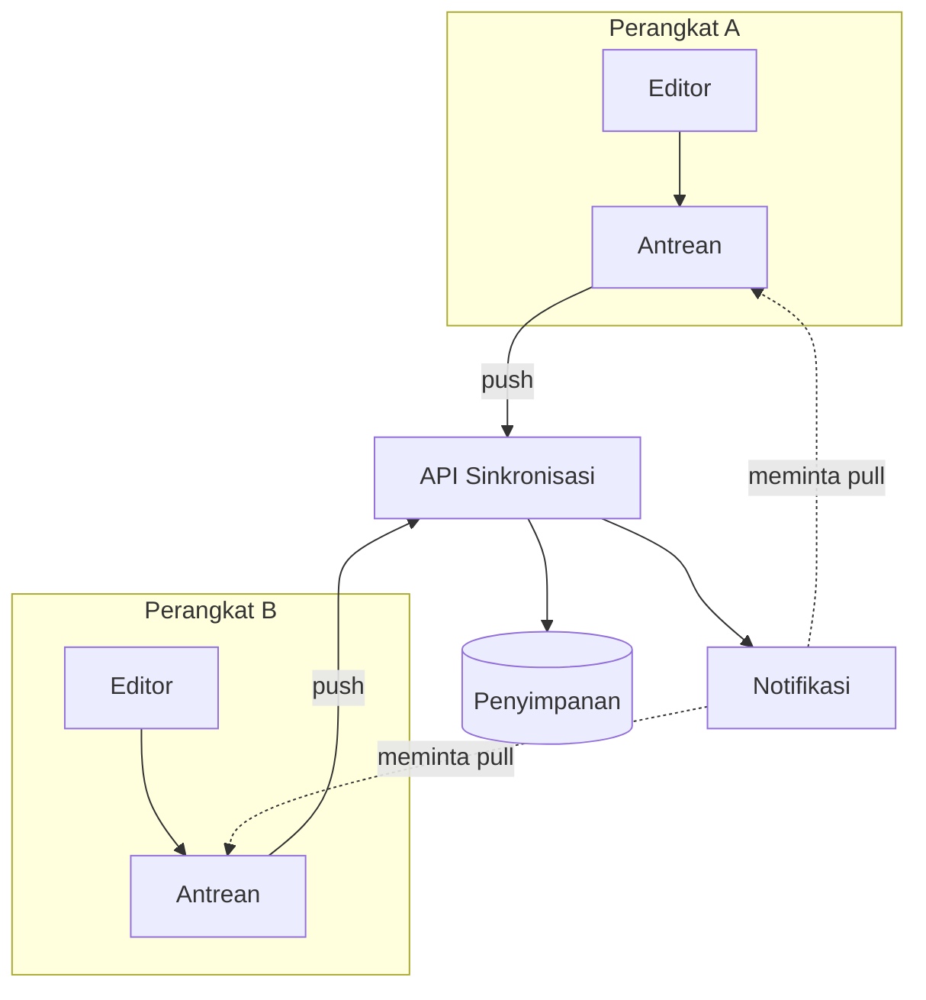

---
navigation:
  order: 10
---

# 3.1 Komponen

| Elemen | Peran |
|---|---|
| Klien | Memantau penyuntingan catatan, memasukkan perubahan ke antrean, dan mengirimkannya ke server saat terhubung |
| API Sinkronisasi | Menerima perubahan, memberi nomor versi, dan mendistribusikannya ke perangkat lain |
| Penyimpanan | Menyimpan isi terkini setiap catatan beserta riwayat 30 hari terakhir |
| Notifikasi | Mengirim sinyal ringan untuk meminta perangkat menarik data, ketika terjadi perubahan |

