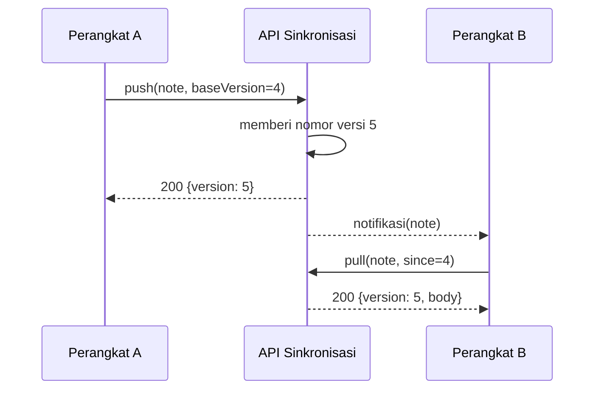

---
navigation:
  order: 20
---

# 3.2 Alur sinkronisasi

Perubahan pada perangkat A memperoleh versi baru di server, lalu perangkat B yang menerima notifikasi mengambilnya. Notifikasi hanyalah isyarat untuk mengambil; notifikasi tidak membawa isi dokumen.
