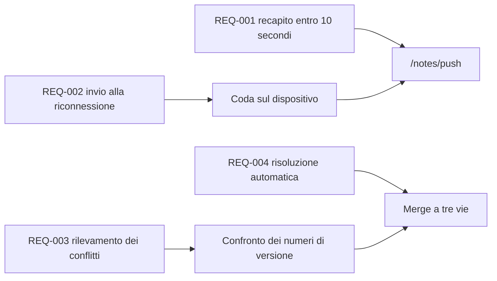

---
navigation:
  order: 30
---

# 2.3 Tracciabilità dei requisiti

I requisiti sono associati a ciascun elemento dell'[architettura](../03-architecture/README.md) e a ciascun endpoint dell'[API](../04-api/README.md). Un requisito privo di associazione è considerato non implementato.

