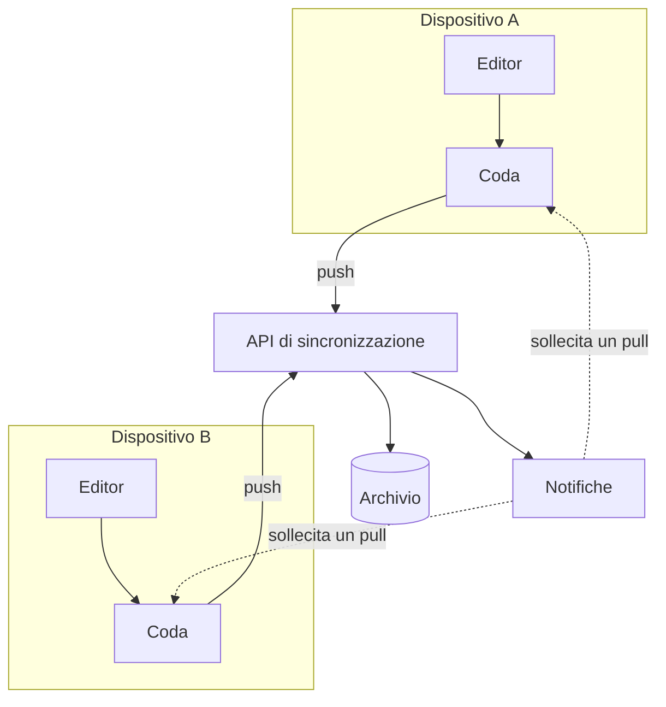

---
navigation:
  order: 10
---

# 3.1 Componenti

| Elemento | Ruolo |
|---|---|
| Client | Rileva le modifiche alle note, le mette in coda e le invia al server alla connessione |
| API di sincronizzazione | Riceve le modifiche, assegna i numeri di versione e le distribuisce agli altri dispositivi |
| Archivio | Contiene il contenuto attuale di ogni nota e la cronologia degli ultimi 30 giorni |
| Notifiche | Invia un segnale leggero al dispositivo per sollecitare un recupero, quando si è verificata una modifica |

