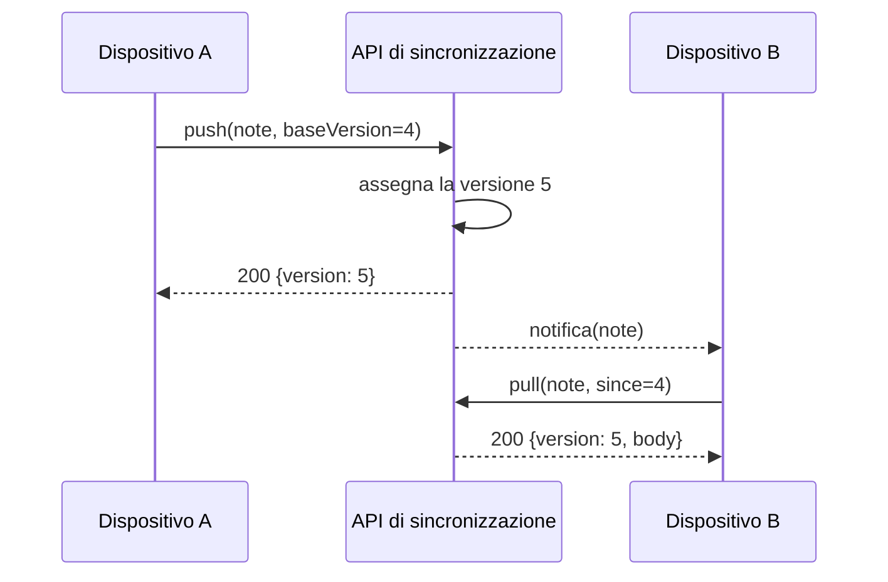

---
navigation:
  order: 20
---

# 3.2 Il flusso di sincronizzazione

La modifica del dispositivo A ottiene una nuova versione sul server e il dispositivo B, una volta ricevuta la notifica, la scarica. La notifica è un segnale che invita a scaricare: non trasporta il corpo del documento.
