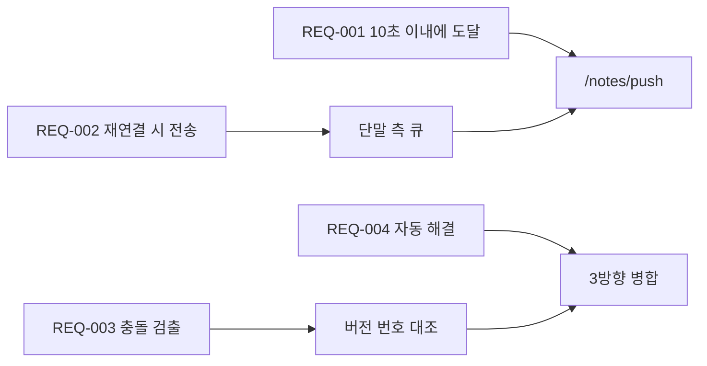

---
navigation:
  order: 30
---

# 2.3 요구사항 추적

요구사항은 [구성](../03-architecture/README.md)의 각 요소와 [API](../04-api/README.md)의 각 엔드포인트에 대응시킨다. 대응이 없는 요구사항은 미구현으로 취급한다.

```mermaid
flowchart LR
  REQ001[REQ-001 10초 이내에 도달] --> PUSH["/notes/push"]
  REQ002[REQ-002 재연결 시 전송] --> QUEUE[단말 측 큐]
  REQ003[REQ-003 충돌 검출] --> VERSION[버전 번호 대조]
  REQ004[REQ-004 자동 해결] --> MERGE[3방향 병합]
  QUEUE --> PUSH
  VERSION --> MERGE
```
