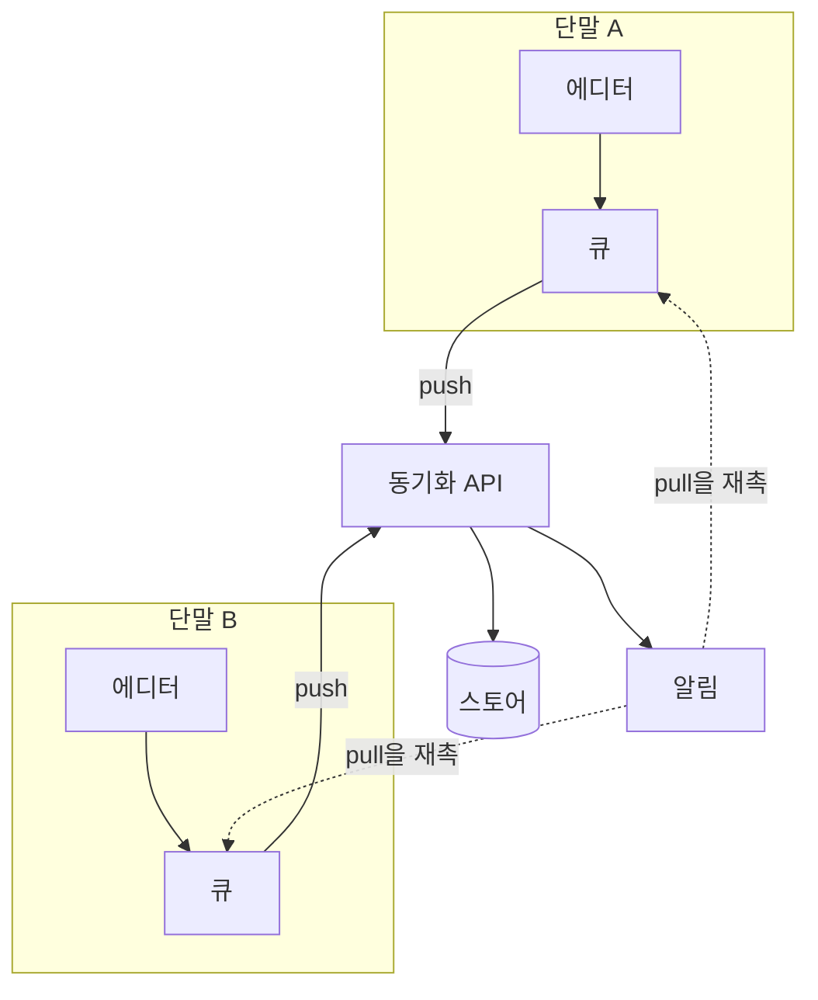

---
navigation:
  order: 10
---

# 3.1 구성 요소

| 요소 | 역할 |
|---|---|
| 클라이언트 | 노트 편집을 감시하고 변경을 큐에 넣어 연결 시 서버로 보냄 |
| 동기화 API | 변경 접수, 버전 번호 부여, 다른 단말로 배포 |
| 스토어 | 노트의 현재 내용과 최근 30일간의 이력 |
| 알림 | 변경이 있었던 단말에 가져오기를 재촉하는 가벼운 신호를 보냄 |

