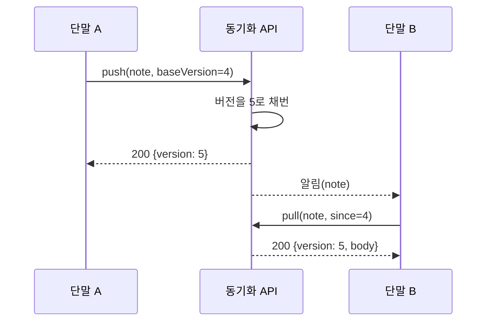

---
navigation:
  order: 20
---

# 3.2 동기화 흐름

```mermaid
sequenceDiagram
  participant A as 단말 A
  participant S as 동기화 API
  participant B as 단말 B
  A->>S: push(note, baseVersion=4)
  S->>S: 버전을 5로 채번
  S-->>A: 200 {version: 5}
  S-->>B: 알림(note)
  B->>S: pull(note, since=4)
  S-->>B: 200 {version: 5, body}
```

단말 A의 변경은 서버에서 새 버전을 받고, 알림을 받은 단말 B가 가져온다. 알림은 가져오기를 촉구하는 신호일 뿐, 본문을 전달하지 않는다.
