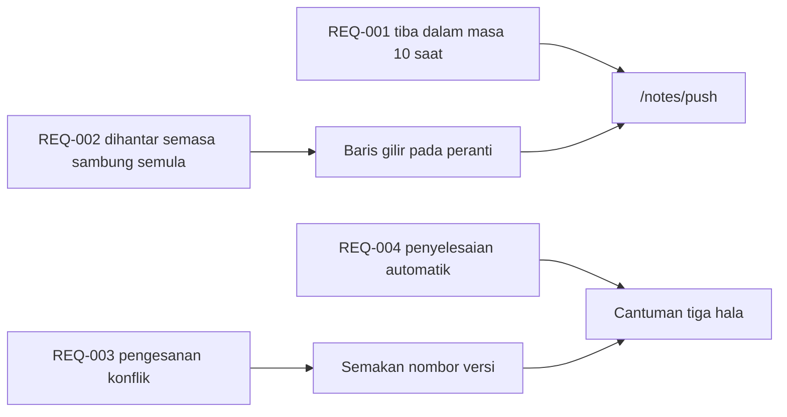

---
navigation:
  order: 30
---

# 2.3 Penjejakan keperluan

Setiap keperluan dipetakan kepada elemen [seni bina](../03-architecture/README.md) dan titik akhir [API](../04-api/README.md). Keperluan yang tiada pemetaan dianggap belum dilaksanakan.

