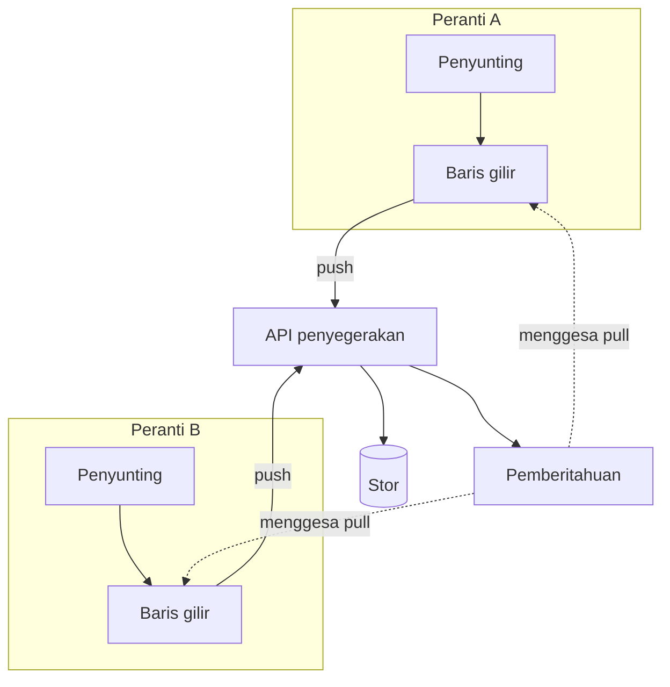

---
navigation:
  order: 10
---

# 3.1 Komponen

| Elemen | Peranan |
|---|---|
| Klien | Memantau suntingan pada nota, membariskan perubahan dalam baris gilir, dan menghantarnya ke pelayan apabila tersambung |
| API penyegerakan | Menerima perubahan, memberikan nombor versi, dan mengedarkannya ke peranti lain |
| Stor | Menyimpan kandungan semasa setiap nota dan sejarahnya bagi 30 hari terakhir |
| Pemberitahuan | Menghantar isyarat ringan untuk menggesa peranti menarik perubahan, apabila berlaku perubahan |

