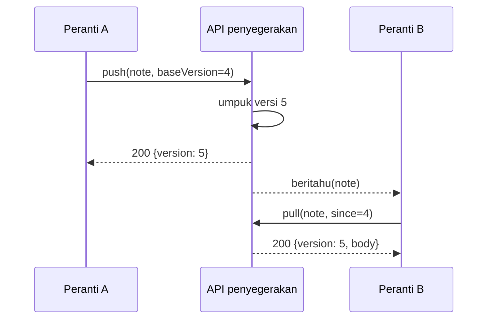

---
navigation:
  order: 20
---

# 3.2 Aliran penyegerakan

Perubahan pada peranti A memperoleh versi baharu di pelayan, dan peranti B yang menerima pemberitahuan akan mengambilnya. Pemberitahuan itu hanyalah isyarat untuk mengambil; ia tidak membawa isi kandungan.
