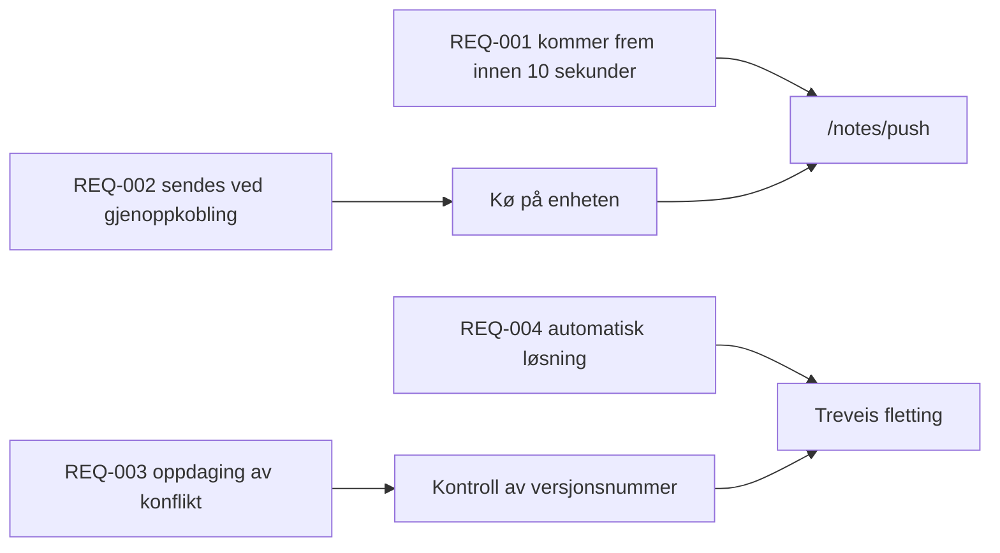

---
navigation:
  order: 30
---

# 2.3 Sporing av krav

Kravene knyttes til elementene i [arkitekturen](../03-architecture/README.md) og til endepunktene i [API-et](../04-api/README.md). Et krav uten kobling regnes som ikke implementert.

