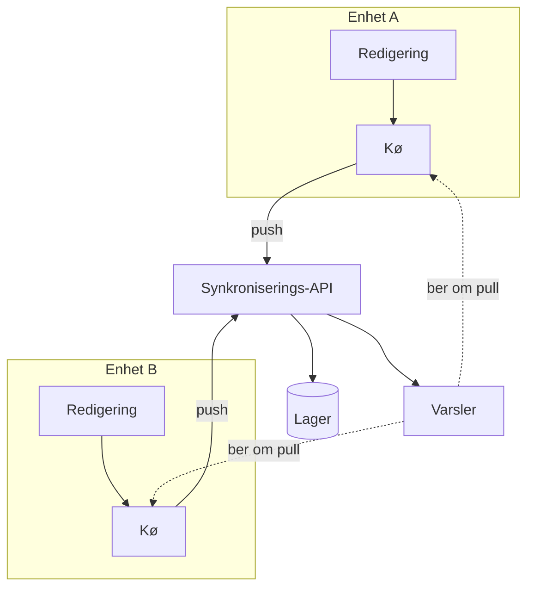

---
navigation:
  order: 10
---

# 3.1 Komponenter

| Element | Rolle |
|---|---|
| Klient | Overvåker redigeringer av notater, legger endringene i kø og sender dem til serveren ved tilkobling |
| Synkroniserings-API | Tar imot endringer, tildeler versjonsnumre og distribuerer dem til andre enheter |
| Lager | Holder det gjeldende innholdet i hvert notat og historikken for de siste 30 dagene |
| Varsler | Sender et lett signal til enheter der en endring har skjedd, for å be dem hente |

